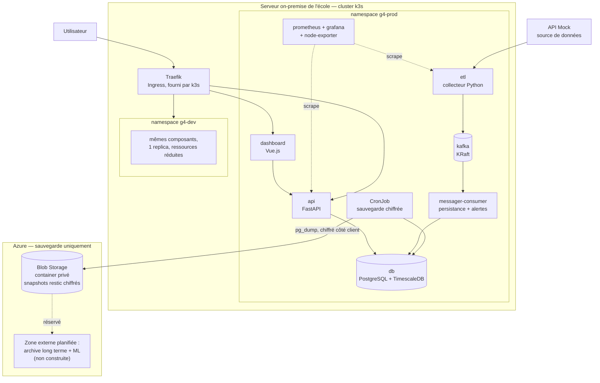
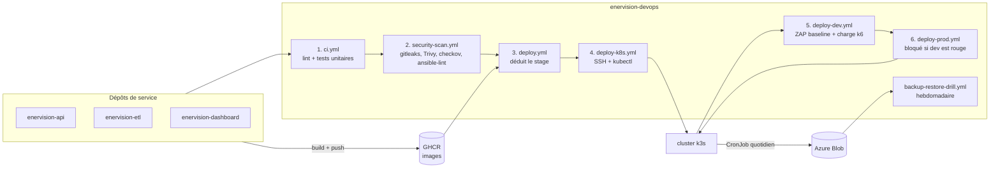

# Architecture de déploiement

Ce document **prolonge** l'architecture applicative décrite dans
`EnerVision - EC01 Architecture` : les mêmes composants (dashboard, API,
bus Kafka, consommateurs, base TimescaleDB, supervision), replacés sur
l'infrastructure qui les exécute réellement. Il ne redéfinit pas
l'architecture applicative, il l'ancre.

Deux ajouts par rapport au schéma d'origine :

1. les composants tournent dans un **cluster k3s**, séparés en deux
   namespaces `g4-dev` et `g4-prod` sur la même machine ;
2. la base est sauvegardée, chiffrée, vers **Azure Blob Storage** — seul
   usage d'Azure dans le projet, et emplacement réservé pour la zone
   externe déjà prévue en EC01 (archive long terme + module ML).

## Vue de déploiement

Points à retenir :

- **Un seul nœud, deux namespaces.** `g4-dev` et `g4-prod` ne partagent
  ni Service, ni Secret, ni volume, ni supervision. Le RBAC de la
  supervision est namespacé : le Prometheus de dev ne peut rien lire de
  prod.
- **Aucune charge applicative sur Azure.** La flèche vers Azure est à
  sens unique et ne transporte que des instantanés chiffrés. Le module
  ML de la zone externe prévue en EC01 n'est pas construit ici : le
  dépôt `enervision-ml` est vide, et déployer un manifeste à zéro replica
  pour un service inexistant n'aurait rien prouvé. Il se branchera comme
  n'importe quel autre service, via `deploy.yml`.
- **Le bus Kafka est déployé.** Il était décrit en EC01 et référencé par
  les variables d'environnement, mais aucun broker n'existait dans le
  dépôt de déploiement. Voir `infra/k8s/base/kafka/`.
- **Traefik est celui de k3s**, pas un contrôleur ajouté. Idem pour le
  stockage : `local-path`, livré d'origine.

## Vue CI/CD

Même système, vu depuis la chaîne de livraison. Les numéros suivent
l'ordre `build → test → scan → deploy` exigé par EC03.

Le point non évident : **les tests unitaires ne s'exécutent pas dans ce
dépôt.** `enervision-devops` ne contient aucun code applicatif. `ci.yml`
et `security-scan.yml` y sont publiés comme workflows *réutilisables*,
que chaque dépôt de service appelle — la politique de CI est définie une
fois et s'applique partout. Mode d'emploi : `ci-usage.md`.

## Un seul contrat de déploiement

`deploy.yml` garde exactement la signature que les dépôts de service
appellent déjà — `service`, `environment`, `image` : **aucun d'eux n'a
été modifié pour passer sur k3s.** Il déduit le stage de la branche
appelante et délègue à `deploy-k8s.yml`, qui exécute
`scripts/k8s-apply.sh` sur l'hôte.

Le déploiement `docker compose` qui existait auparavant a été retiré :
maintenir deux chemins parallèles vers la même machine coûtait deux fois
la documentation et le débogage, pour un chemin qu'on n'aurait de toute
façon pas utilisé une fois k3s en place. Il reste récupérable dans
l'historique Git (`git show develop:compose/api.yml`).

## Où vit quoi

| Besoin | Emplacement |
|---|---|
| Manifestes Kubernetes | `infra/k8s/base/`, surcouches `infra/k8s/overlays/{dev,prod}/` |
| Provisionnement des machines | `infra/ansible/` |
| Ressources Azure (sauvegardes) | `infra/terraform/` |
| Chaîne CI/CD | `.github/workflows/` |
| Sauvegarde et restauration | `scripts/`, `infra/k8s/base/backup/` |

## Voir aussi

- `k8s-primer.md` — les notions Kubernetes utilisées ici, expliquées
- `infra-decision.md` — pourquoi on-premise + Azure pour la seule
  sauvegarde, argumenté sur les cinq axes imposés
- `quality-gates.md` — ce qui bloque une fusion et ce qui informe
- `runbook.md` — installation, déploiement, retour arrière, restauration
- `ci-usage.md` — brancher un dépôt de service sur cette chaîne
